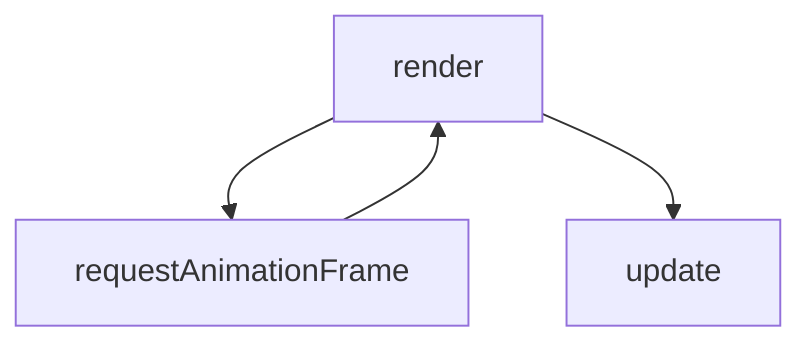
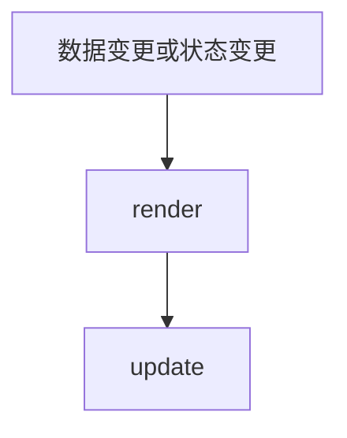
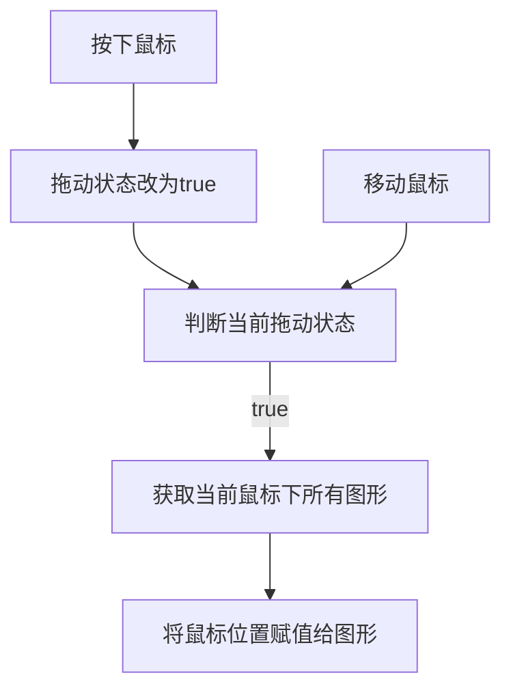
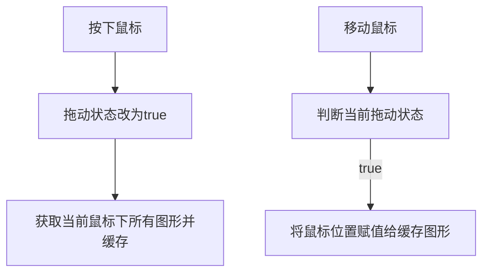

# 基于 Canvas 开发一款交互式画布引擎

## 起始！想搞啥

本人对可视化以及网页搞音乐这种花活很感兴趣，所以之前闲下来想看看别人的源码库，研究一下别人是如何实现一个 webgl 可视化引擎的。看着看着突然就觉得，别人的库为什么这么设计，类为什么这么定义，对于我来说就是硬灌，我只知道他们能写出一个成熟引擎，很厉害，学就是了。


源码越看到后面就觉得这也太庞大复杂了，俗话说得好，罗马不是一天建成的，所以我把库退回到最开始提交的时候看最起始的版本，这应该不会很庞大复杂了吧。


然后悲剧的是，我发现其实刚开始也已经是个比较完整的引擎了，这时候我就打算自己先写一个试试，这样对遇到的问题啥的都印象更深刻，对模块的设计也有更清晰的认识。


## 开整！起项目

起手那肯定牌面是要有的，虽然我不一定能写出多个项目库，但我要用可以管理多个项目的 lerna 来开始项目。（其实是顺便学习怎么使用 learn 了）


创建好项目后，创建一个项目叫@canvas-lib/core，我宣布这就是核心代码库了，然后再起一个模块叫 test，写成啥样总是要页面上引入跑一跑才能有数的。这样子项目的基本结构就确定了：


## 模块！搞起来

接下来要设计核心库的模块了，这部分其实耗费了好几天的时间，因为最基础的设计都是一变再变，到目前为止有以下模块构成：


### Engine

引擎模块是整个项目的起点，基本主要的类都从这里开始初始化。当然主要是 Canvas 画布模块和用来存储画布上物体的 Scene 场景模块了，还有一个尚不成熟的事件模块的分发器和一个比较简单的单纯由 raf 实现的渲染模块。

```ts
export class Engine {
  public scene: Scene;
  public canvas: Canvas;
  public dispatcher: EventDispatch;

  constructor(container: string, canvasOptions?: CanvasOptions) {
    this.initEngine(container, canvasOptions);
  }

  initEngine(container: string, canvasOptions?: CanvasOptions) {
    this.scene = new Scene();
    this.canvas = new Canvas(container, this.scene, canvasOptions);
    new Render(this);
    this.dispatcher = new EventDispatch();
    new Behavior(this);
  }

  on(type: EventType, fn: (event: Event) => void) {
    this.dispatcher.on(new Event(type, this, {}), fn);
  }

  off(type: EventType, fn: (event: Event) => void) {
    this.dispatcher.off(type, fn);
  }
}
```

### Canvas

canvas 计划中是有默认配置的，不过目前还没加，所以 options 是可选，但代码里不存在就直接 return 了。

```ts
public initCanvas(container: string, options?: CanvasOptions) {
        if (!container) return;
        this._canvas = document.getElementById(container) as HTMLCanvasElement;
        this._ctx = this._canvas.getContext("2d");
        if (options) {
            if (options.width) this._canvas.width = options.width;
            if (options.height) this._canvas.height = options.height;
            if (options.bgColor) {
                this._ctx.fillStyle = options.bgColor.hex;
                this._ctx.fillRect(0, 0, this._canvas.width, this._canvas.height);
            }
        }
        return this;
    }
```

### Scene

场景这块是一个比较简单的数据来管理，之后应该会丰富一下内容，方便成组来管理图形。

```ts
export class Scene {
  public entityList: Array<Entity>;

  constructor() {
    this.initScene();
  }

  initScene() {
    this.entityList = [];
    return this;
  }

  add(entity: Entity) {
    this.entityList.push(entity);
  }

  remove(id: string | number | symbol) {
    const idx = this.entityList.findIndex((entity: Entity) => entity.id === id);
    const len = this.entityList.length;
    const temp = this.entityList[len - 1];
    this.entityList[idx] = temp;
    this.entityList.pop();
  }

  getContainsShapes(point: Point) {
    const shapes = [];
    this.entityList.forEach(entity => {
      if (entity.isContains(point)) {
        shapes.push(entity);
      }
    });
    return shapes;
  }
}
```

### EventDispatch

事件这块也是简单的实现了一个基础，然后其他地方写出个什么事件就给事件类型加个什么事件。这一块也是所有模块里反复修改最多的，因为一开始对事件管理这块的逻辑不熟悉，导致设计的比较混乱，最后用的时候很臃肿繁杂，后来简化了一下才是目前的效果。

```ts
export class EventDispatch {
  private _events: any;
  private _listener: Listener;

  constructor() {
    this._events = Object.create(null);
    this._listener = new Listener();
  }

  on(event: Event, fn: (event: Event) => void) {
    if (this._events[event.type]) {
      this._events[event.type].push({
        fn,
        event
      });
    } else {
      this._events[event.type] = [
        {
          fn,
          event
        }
      ];
      this._listener.addEventListener(event.type, this.mouseEvent.bind(this));
    }
  }

  off(type: EventType, fn: (event: Event) => void) {
    if (this._events[type]) {
      const idx = this._events[type].findIndex(i => i.fn === fn);
      const len = this._events[type].length;
      if (len < 2 && idx < 1) {
        delete this._events[type];
        this._listener.removeEventListener(type, this.mouseEvent.bind(this));
      } else {
        this._events[type][idx] = this._events[type][len - 1];
        this._events[type].pop();
      }
    }
  }

  dispatch(type: string, data: any) {
    if (this._events[type]) {
      this._events[type].forEach(_event => {
        _event.event.data = { ..._event.event.data, ...data };
        _event.fn(_event.event);
      });
    }
  }

  mouseEvent(event: MouseEvent) {
    this.dispatch(<EventType>event.type, { event });
  }
}
```

## 继续！搞下去

目前只是做一个起始的小结，算是搭好了基础框架，可以以此为基础先横向丰富内容，然后纵向扩充。我在问别人模块设计的意见或者功能的设计的时候，别人问我，我最终想要做成什么样子，要以结果为导向。但是我说我不知道，我从开始做就只是想要学习，没有什么具体的目标，我觉得我这或许是以学习为导向，想到什么就做什么。虽然这样比较乱，会想起一出是一出，但是我感觉，这才是我喜欢的前端，可以想做什么做什么，兴趣所在，就是正确的。


## 本篇重点

在上次做完初始的小结之后，我打算对引擎的基础进行一些完善。最基本的重新渲染以支持动画，或者实现一个画布网格背景，这都是我想要加入的，但是在这过程中也遇到了很多问题，所以我想把这个过程中遇到的问题和解决方式都记录下来。

## 动画支持

这块我最开始的想法是，写一个渲染器，然后通过`requestAnimationFrame`来做到持续刷新画布，这样我就可以做到数据更新后画布也更新，实现一个动画的效果。关键代码如下：

```ts
renderer(){
    this._engine.canvas.update(); // 画布更新即清除画布所有内容重新绘制
    this._lastTime = this._nowTime;
    this._nowTime = performance.now();
    this._fps = Math.round(1000/(this._nowTime-this._lastTime));
    window.requestAnimationFrame(()=>{
        this.renderer(); // 重复自调用实现画布更新
    });
}
```



这么完成以后效果是还行的，然后输出 fps，基本是 60 左右浮动，我当时觉得还行，并没有察觉出什么问题。直到我做了下一步操作，鼠标拖动图形之后，页面的卡顿超乎我的想象。最直观的感受就是，我拖动图形时，图形并不是紧跟鼠标的，而是以跟随的效果，完成拖动的路径。

然后经过我与同事的讨论，我发现了两个导致这个情况出现的问题，这里先谈渲染导致的。

我同事的意见是，既然我这个是个 canvas 引擎，那么渲染的时机为什么是 raf 来决定，而不是引擎来决定。听完这句话的我，醍醐灌顶，反应过来了。我又不是在做动画，我做的是动画支持，自然不需要用一个定时渲染来做画布的更新，我应该是在引擎触发更新时更新画布。

然后我就对鼠标拖动部分的代码做了修改，当图形有事件触发或者数据变更时，触发更新方法，更新画布。关键代码如下：

```ts
/* render.ts */
/* 这里渲染器去掉了raf，改成了单次渲染，并计算fps */
renderer(){
    this._engine.canvas.update();
    this._lastTime = this._nowTime;
    this._nowTime = performance.now();
    this._fps = Math.round(1000/(this._nowTime-this._lastTime));
}

/* behavior.ts */
/* 当拖动图形后，通过引擎update方法触发画布更新 */
const offset = [0,0];
if(this._isDrag){
    if(this._dragBeforePointer){
        offset[0] = pointer.x-this._dragBeforePointer.x;
        offset[1] = pointer.y-this._dragBeforePointer.y;
    }
    this._dragBeforePointer = pointer;
    if(this._dragShape){
        this._dragShape.center.x += offset[0];
        this._dragShape.center.y += offset[1];
        this._engine.dispatcher.dispatch("shapedrag",{
            event:e.data.event,
            shape:this._dragShape
        });
        this._engine.update();
        return;
    }else{
        this._engine.canvas.translate(offset[0],offset[1]);
        this._engine.update();
        return;
    }
}
```



改完后再也没有跟随的情况发生了，鼠标移动则图形移动。输出 fps，可以看到在鼠标拖动图形时，fps 可以达到一千左右，鉴于鼠标的刷新率最高就是一千多，我感觉这个 fps 最高可能和鼠标刷新率有关。

## 图形拖动

图形拖动设计导致的问题，也是上面提到的图形跟随的原因之一。

这个问题的成因在于我设计图形拖动这个功能时，想要即时算出 move 事件触发时，鼠标位置的所有图形。因为每个图形的 class 我都会添加`isContains`方法来判断一个点是否在图形内，所以我只需要获取场景中所有图形调用该方法，然后返回一个数组即可。

```ts
getContainsShapes(point:Point){
    const shapes = [];
    this.entityList.forEach(entity=>{
        if(entity.isContains(point)){
            shapes.push(entity);
        }
    });
    return shapes;
}
```

```ts
onMouseDown(e:Event){
    const pointer = new Point(e.data.event.x,e.data.event.y);
    this._isDrag=true;
    this._dragBeforePointer = null;
    this._dragShape = this._engine.scene.getContainsShapes(pointer);
}
```



但是按这个方法实现以后，发现性能比较一般，所以思考以后换为另一种实现方式。即常规的，mousedown 事件直接缓存点击到的位置获取到的所有图形，然后每次移动都赋值新的鼠标位置。



上一个其实还没优化到位，因为只是不需要在拖动的时候持续获取图形列表，但是获取图形列表这个操作本就不是很舒服，所以下一步就是直接重构整个画布的图形拾取。

## 画布图形拾取

一开始图形的拾取是靠一个坐标点，然后判断是否在图形内计算，但是在开发过程中，我感觉到这样的方式对运行性能带来了极大的负荷，但是我又想不出好的解决方案。然后我开始查找别人是如何判断拾取图形的，最终在各种方案下，我决定学习再创建一个 canvas，通过点击像素颜色识别图形的方案。

这个方案其实就是在画布上叠一层看不见的蒙版，没有图形的位置像素点是白色，有图形的位置则是各种颜色，理论上这种方法支持 16777215 个图形的辨识。

```ts
this._detectionCanvas = document.createElement("canvas");
this._detectionCtx = this._detectionCanvas.getContext("2d", { alpha: false });
// document.body.appendChild(this._detectionCanvas);
if (options.width) this._detectionCanvas.width = options.width;
if (options.height) this._detectionCanvas.height = options.height;
this._shapeMap = new Map();
this._colorMap = new Map();
```

```ts
public detectionShape(point:Point):Entity{
    const imgData = this._detectionCtx.getImageData(point.x,point.y,1,1);
    const color = [imgData.data[0],imgData.data[1],imgData.data[2]].join(",");
    if(this._shapeMap.has(color)){
        return this._shapeMap.get(color);
    }
}
```

在这里因为需要通过图形映射颜色，做到相同图形不会更换颜色导致拾取出现问题，又需要通过颜色映射图形，在拾取时直接找到图形对象，所以我需要一个双向映射的结构，但因为暂时没有什么更好的思路，所以只是使用了两个 map 来做到双向映射。

## 虚拟坐标系的建立

因为图形拖动实现以后，我又想实现画布的拖动，所以我搜索了 canvas 的 api 发现了画布变换方法，于是我打算使用这个方法来实现画布的变换。

```ts
public translate(x:number,y:number){
    this._ctx.translate(x,y);
    this._detection.translate(x,y);
}
```

但是在这么实现以后，问题出现了。因为画布更新需要清空画布重绘，所以我使用的是`clearRect`方法清空画布，在移动画布以后，该方法只会清除固定的那块区域，导致区域外的部分不会被清空。所以我需要一个虚拟坐标系，即画布不动，虚拟坐标系移动。

```ts
export interface CanvasTransform {
  translate: CanvasTranslate;
}

export interface CanvasTranslate {
  x: number;
  y: number;
}
```

```ts
public translate(offsetX:number,offsetY:number){
    const x = this._transform.translate.x+offsetX;
    const y = this._transform.translate.y+offsetY;
    this._transform.translate = {x,y};
    this._detection.translate(x,y);
}
```

这部分目前只添加了平移操作，实际体验效果还不错，之后打算加入缩放和旋转，算是难度逐渐升高。

## 小结

下个阶段依旧是对项目基础功能的完善，以及图形的扩充，我也会在开发中继续学习，看到学到更多的东西。
